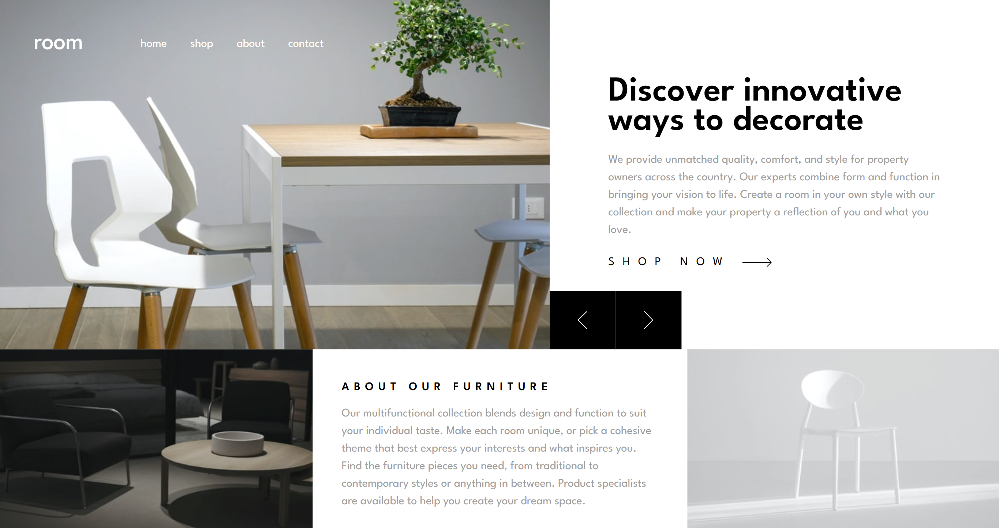

# Frontend Mentor - Room homepage solution

This is a solution to the [Room homepage challenge on Frontend Mentor](https://www.frontendmentor.io/challenges/room-homepage-BtdBY_ENq). Frontend Mentor challenges help you improve your coding skills by building realistic projects. 

## Table of contents

- [Overview](#overview)
  - [The challenge](#the-challenge)
  - [Screenshot](#screenshot)
  - [Links](#links)
- [My process](#my-process)
  - [Built with](#built-with)
  - [What I learned](#what-i-learned)
- [Author](#author)

## Overview

### The challenge

Users should be able to:

- View the optimal layout for the site depending on their device's screen size
- See hover states for all interactive elements on the page
- Navigate the slider using either their mouse/trackpad or keyboard

### Screenshot

### Links

- Solution URL: [Repo](https://github.com/Andigashi1/Room-homepage)
- Live Site URL: [Live Site](https://room-homepage-nine-azure.vercel.app)

## My process

### Built with

- CSS custom properties
- Flexbox
- Mobile-first workflow
- [React](https://reactjs.org/) - JS library
- [Tailwind](https://tailwindcss.com/) - CSS Framework

### What I learned

I learned how to make an image slider along with a little animation. Im proud of how the image slider and the text beside it turned out.

## Author

- Frontend Mentor - [@Andigashi1](https://www.frontendmentor.io/profile/Andigashi1)
- LinkedIn - [Andi Gashi](https://www.linkedin.com/andi-gashi2004)

